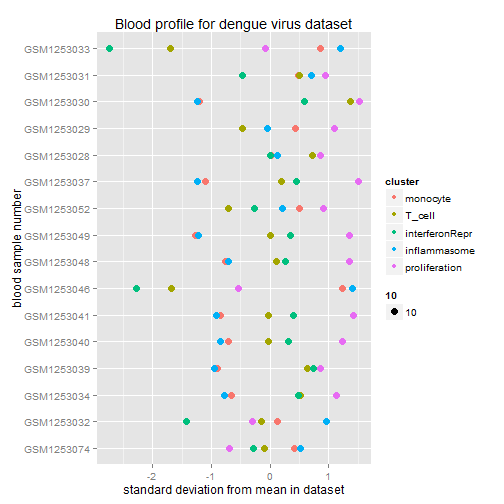

## The opportunity

1.  Many blood gene expression datasets are publicly available in the GEO (gene expression omnibus) datasets collection.

2. These datasets have been mainly analysed in isolation for specific experimental questions.

3. It would be nice to compare these experimental data systematically for a better overview.

4. Gene expression data might become medically
relevant blood tests.

--- .class #id 

## Basic features for profiling

1. GEO profiles already offers many options to study the datasets. 

2. Datasets typically contain expression tables with different patient samples  (10 - ~ 200) as variables and 10,000 - 20,000 observations for different genes.  

3. New features were derived by grouping co-expressed genes in clusters, by determining correlation patterns in many datasets. 

4. Gene clusters can then be used as new features, and mostly correspond with the different blood cell types or different things such as inflammation.   

--- .class #id 

## visualisation and analysis

1. Good graphics can help to recognize common themes in the data, thus using ggplot2 package.

2. A Shiny (Rstudio) App allows fast and easy comparisons between many pre-processed datasets, looking at the different features by using widgets. 

3. The main outputs are

1. A) a plot showing blood profiles for celltypes, etc, which can be ordered by value.

2. B) a cluster analysis for the selected dataset using the pheatmap package in R.

3. C) a datatable to check the experimental annotation for the different sample numbers.

--- .class #id 

## An example 

In this particular subsetted example features can be seen to correlate.

 

--- .class #id 

## conclusion

1. With the bloodVis App it is possible to systematically compare different datasets with uniform features and analysis.

2. App can be adapted to increase the number of datasets from 8 to more. Also, new (sub)features can be added etc.

3. Public datasets such as GEO datasets can be harvested for new analysis.

